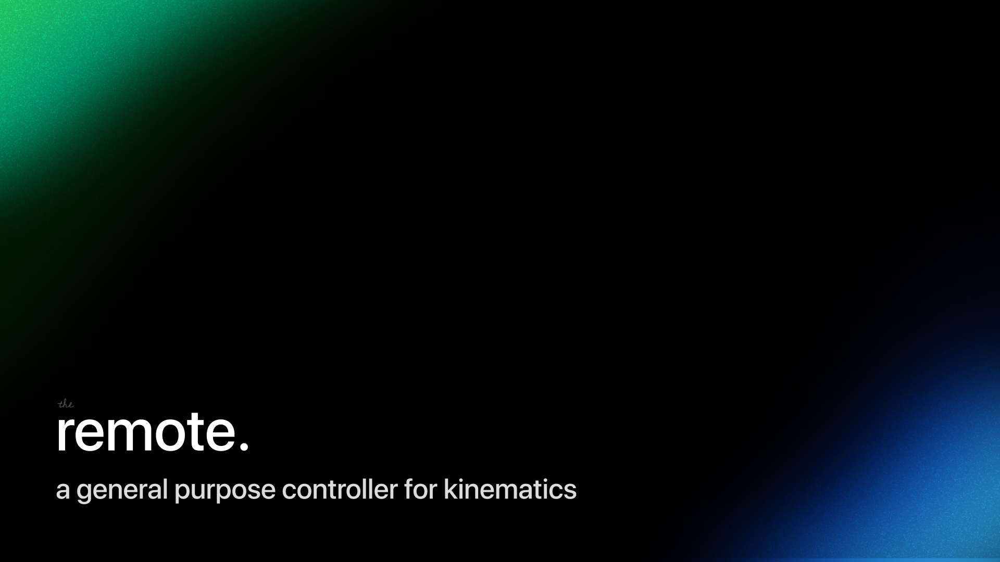

<h1 align="center">A modern controller for kinematics</h1>
<br>
<p align="center">
  
</p>
<br>

<p align = "center">
    
    
    
    
    
</p>
<br>

## 📋 Description
  
<p align="center">This mobile app is designed to control a robotic arm using Flutter and Dart. The app provides an intuitive interface for users to interact with the robotic arm and perform various actions and movements.</p>

## 🔧 Languages Used
  <p align="left"> 
      <a href="https://www.python.org/"></a>
    <a href="https://dart.dev" target="_blank">
  </p>
  
## 🔨 Tools
  <p align="left"> 
    <a href="https://code.visualstudio.com/" target="_blank"></a>
    <a href="https://flutter.dev/"></a>
    </a>
    <a href="https://www.figma.com/" target="_blank"></a>
    <a href="https://www.adobe.com/creativecloud.html" target="_blank"></a>
    <a href="https://www.microsoft.com/en-us/microsoft-365/powerpoint" target="_blank">
    <a href="https://git-scm.com/" target="_blank"></a>
    <a href="https://git-scm.com/" target="_blank"></a>
  </p>
 
## 🔧 Installation

```
You can download our project by using the green "Code" button.

Or by pasting the following code in your CMD:
git clone https://github.com/VTIvanov20/remote.git
```

## ⚙ Build from source

*To run the app localy, follow these steps after installation:*
```
cd  app
flutter doctor
flutter run
```

*To run some of the scripts for the hardware, follow these steps after installation:*

```
cd arm
cd sandbox
python instructions.py
```
and run the sockets in parallel:
```
cd arm
cd sockets
python sockets.py
```

<h3>Enjoy the project!</h3>
<p align="center">
  
</p>
